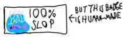

# biangbiang

**简体中文** · [English](README_en_US.md)



一站式自托管 **GitHub Release 构建产物镜像**。它会跟踪 `config.xml` 中列出的每个项目的最新 Release，把构建产物下载到你的服务器，并通过一个快速、适配移动端的 Vue + [Ant Design Vue](https://antdv.com) 前端对外提供下载。

整个项目运行在**单个 Docker 容器**内：一个 Node.js (Express) 进程同时提供 API、镜像文件以及构建好的单页应用。

> 仓库地址：<https://github.com/KZacharski/biangbiang/>
> 部署文档：[进阶部署指南（简体中文）](ADVANCED_INSTRUCTION_zh_CN.md) · [Advanced Deployment Guide (English)](ADVANCED_INSTRUCTION_en_US.md)

---

## 功能特性

- **自动镜像**每个 GitHub Release 中附带的所有构建产物。
- **排除源码归档**——GitHub 自动附加的 `Source code (zip)` / `Source code (tar.gz)` 永远不会被镜像。
- **每 24 小时检查一次更新**（可配置），并且每个项目在磁盘上只保留最新版本。
- **支持任意数量的项目**——`config.xml` 中每个 `<project>` 对应一张卡片。
- **支持手动条目**——`<repo>` 写成 `overwrite@<数字>` 时，卡片数据改由 `overwrite.xml` 提供，从而把 GitHub 项目与任意外部下载链接混合在同一个站点里。
- **完全由配置驱动**：标题、favicon 以及各项目的图标/名称/仓库地址全部来自 `config.xml`；图标为使用者自行提供的 PNG/WEBP 文件。
- **浅色 / 深色主题**，默认「跟随系统」，可手动切换为浅色或深色。基于 Ant Design Vue 的设计令牌实现。
- **可安装为 PWA**（manifest + Service Worker）——按设计**不提供离线缓存**。
- **简体中文（zh-Hans）**界面，文案硬编码。
- **适配移动端**的响应式布局。
- **健壮性**：某个仓库损坏或地址错误不会拖垮整个站点——同步失败的项目会保留上一次成功的数据。

---

## 工作原理

```text
                    每 24 小时  ┌──────────────────────────────┐
        GitHub REST API ──────► │  镜像引擎（后端）            │
   (releases/latest)            │  · 获取最新 Release          │
                                │  · 下载构建产物              │
                                │  · 删除旧版本                │
                                └──────────────┬───────────────┘
                                               │ 写入
                                               ▼
                              data/releases/<owner>/<repo>/<version>/<file>
                                               │
   浏览器 ──► Express ─────────────────────────┘
                 ├─ /                  → 构建好的 Vue SPA（静态文件）
                 ├─ /api/state         → 实时 JSON：标题、项目、版本、构建产物
                 ├─ /media/<path>      → 来自配置目录的 favicon 与项目图标
                 └─ /dl/<owner>/<repo>/<version>/<file>  → 镜像后的构建产物
```

前端是一个**静态打包产物**，但它渲染的数据是在运行时通过 `GET /api/state` 获取的。当有新的 Release 被镜像后，版本标签和下载按钮的集合会自动更新——**永远不需要重新构建前端**。页面还会定时刷新数据（并在标签页重新获得焦点时刷新），让长时间打开的页面保持最新。

---

## 项目结构

```text
biangbiang/
├── .github/assets/         # README 徽章
├── config.xml              # 你的配置（挂载进容器）
├── overwrite.xml           # 可选：手动条目（非 GitHub 项目，挂载进容器）
├── assets/                 # 你的 favicon 与项目图标（挂载，只读）
├── data/                   # 镜像产物、state.json、生成的 PWA 图标
├── backend/                # Node.js + Express 的 API / 镜像引擎
│   └── src/
│       ├── index.js        # HTTP 服务：SPA、/api、/media、/dl
│       ├── cli.js          # 单次镜像运行（npm run mirror）
│       ├── config.js       # 解析 config.xml + 规范化仓库地址
│       ├── github.js       # GitHub API 客户端 + 流式下载
│       ├── mirror.js       # 镜像引擎（比对、下载、清理）
│       ├── overwrite.js    # 解析 overwrite.xml（手动条目）
│       ├── pwaIcons.js     # 用 ImageMagick 由 favicon 生成 PWA 图标
│       ├── scheduler.js    # 每 24 小时运行的定时任务
│       ├── state.js        # 内存态 + 持久化状态
│       └── env.js          # 环境变量配置
├── frontend/               # Vue 3 + Vite + Ant Design Vue 的 SPA
│   ├── public/             # manifest、Service Worker、PWA 默认图标
│   └── src/
│       ├── App.vue         # ConfigProvider（主题 + zh-CN 语言包）
│       ├── api.ts          # API 客户端与格式化工具
│       ├── theme.ts        # 自动 / 浅色 / 深色主题逻辑
│       ├── strings.ts      # 硬编码的简体中文界面文案
│       └── components/     # SiteView、ProjectCard、ThemeSwitcher
├── Dockerfile
├── docker-compose.yml             # 最简示例
├── docker-compose.advanced.yml    # 生产部署示例（仅绑定回环地址 + nginx）
├── .env.example                   # 复制为 .env 后使用
├── ADVANCED_INSTRUCTION_zh_CN.md  # 进阶部署指南（简体中文）
├── ADVANCED_INSTRUCTION_en_US.md  # 进阶部署指南（美式英语）
├── README_en_US.md                # README（美式英语）
└── README.md
```

---

## 配置说明（config.xml）

`config.xml` 与 `assets/` 目录放在一起。所有图片路径都**相对于 `config.xml` 所在的目录**解析，因此图标既可以与它并排存放，也可以放在 `assets/` 子目录中。

```xml
<favicon>assets/favicon.png</favicon>
<title>Page title</title>

<project>
    <icon>assets/icon1.png</icon>
    <name>Project 1</name>
    <repo>https://github.com/user/project1</repo>
</project>

<project>
    <icon>assets/icon2.webp</icon>
    <name>Project 2</name>
    <repo>https://github.com/user/project2</repo>
</project>
```

| 标签        | 位置           | 说明 |
|-------------|----------------|------|
| `<title>`   | 根节点         | 站点标题，显示在页头与浏览器标签页。 |
| `<favicon>` | 根节点         | 可选。用作站点 favicon 的 PNG/WEBP 文件。 |
| `<project>` | 根节点（0..N） | 每个项目一项 → 站点上的一张卡片。 |
| `<icon>`    | 项目内         | 卡片图标所用的 PNG/WEBP 文件。可选。 |
| `<name>`    | 项目内         | 项目显示名称。 |
| `<repo>`    | 项目内         | GitHub 仓库地址。 |

**支持的 `<repo>` 写法**（都会解析为 `owner/repo`）：

```text
https://github.com/user/project1
https://github.com/user/project1.git
https://github.com/user/project1/
git@github.com:user/project1.git
user/project1
```

可以自由增删 `<project>` 段落——站点始终为每个有效条目渲染且仅渲染一张卡片。`<repo>` 缺失或格式错误的条目会被跳过，且不影响其他条目。

### 手动条目（overwrite.xml）

`<repo>` 除了写 GitHub 地址，还可以写成 `overwrite@<数字>`。这样这张卡片的数据就不再来自 GitHub，而是来自与 `config.xml` **同目录**下的 `overwrite.xml`：

```xml
<project>
    <icon>assets/icon2.webp</icon>
    <name>我的私有项目</name>
    <repo>overwrite@1</repo>
</project>
```

`overwrite.xml` 的结构：

```xml
<overwrite>
    <id>1</id>
    <version>1.0.0</version>
    <repo>https://example.com/my-project</repo>
    <downloads>
        <file>https://example.com/artifact.zip</file>
        <file>https://example.com/artifact2.rar</file>
    </downloads>
</overwrite>
```

| 标签                 | 说明 |
|----------------------|------|
| `<id>`               | 与 `config.xml` 中 `overwrite@<数字>` 的数字对应。 |
| `<version>`          | 卡片上显示的版本号，代替自动获取的版本。可省略。 |
| `<repo>`             | 「查看原仓库」按钮指向的地址。可省略，省略时该按钮不显示。 |
| `<downloads>/<file>` | 每个 `<file>` 对应一个下载按钮，按钮直接指向该外部链接。 |

要点：

- **只有**当 `config.xml` 中至少存在一个 `overwrite@<数字>` 时才会去读取 `overwrite.xml`。如果所有 `<repo>` 都是 GitHub 地址，这个文件根本不会被打开。
- 手动条目**不会**下载或缓存任何文件——下载按钮直接指向你填写的外部链接，因此不占用服务器磁盘，也不受 GitHub 速率限制影响。
- 手动条目**不显示「发布于」日期**（没有 Release，自然没有发布日期）；文件大小同样无法得知，因此也不显示。
- 同一个 `config.xml` 中可以随意混用 GitHub 项目与手动条目。
- 下载按钮上显示的文件名取自链接 URL 的最后一段。
- Docker 部署时 `overwrite.xml` 会与 `config.xml` 一样以只读方式挂载进容器，无需任何额外操作。

> **图片完全由使用者提供。** 把你自己的 PNG/WEBP 文件放在 `config.xml` 旁边（或 `assets/` 子目录中），并在配置里引用它们。仓库内自带的图片仅作占位符。

---

## 快速开始（Docker）

> **要部署到公网服务器？** 请看进阶指南：
> [简体中文](ADVANCED_INSTRUCTION_zh_CN.md) ·
> [English](ADVANCED_INSTRUCTION_en_US.md)。
> 它涵盖 `docker-compose.advanced.yml` 示例、`config.xml` 详解、图片素材的放置方式，
> 以及用 nginx 反向代理把容器接入域名并配置 HTTPS。

### 1. 获取项目

```bash
git clone https://github.com/KZacharski/biangbiang.git
cd biangbiang
```

### 2. 准备配置与图标

```
biangbiang/
├── config.xml
├── overwrite.xml           # 可选：仅在用到 overwrite@<数字> 时需要
└── assets/
    ├── favicon.png
    ├── icon1.png
    └── icon2.webp
```

编辑 `config.xml`，填入站点标题与你的项目（语法见上一节）。

> **用到手动条目时**，直接在 `overwrite.xml` 里填写条目即可——`docker-compose.yml` 已经把它挂载进容器了。
>
> 改完宿主机上的文件后，点一下界面上的「立即检查更新」就会生效，不需要重建容器。
>
> 注意保持文件存在：若 `./overwrite.xml` 缺失，Docker 会把它建成一个空目录，相关卡片会以 `EISDIR` 报错。仓库自带一份可直接使用的样例，新克隆的仓库不受影响。

### 3. 构建并启动

```bash
docker compose up -d --build
```

### 4. 打开站点

浏览器访问 <http://localhost:8080>。

首次同步会在容器启动时立即开始；之后每 24 小时同步一次（见 `CHECK_INTERVAL_HOURS`）。镜像产物保存在宿主机的 `./data` 目录中，重启后依然保留。

### 不使用 Compose 直接运行

```bash
docker build -t biangbiang .
docker run -d --name biangbiang -p 8080:8080 \
  -v "$PWD/config.xml:/app/config.xml:ro" \
  -v "$PWD/assets:/app/assets:ro" \
  -v "$PWD/data:/app/data" \
  biangbiang
```

### 常用运维命令

```bash
docker compose logs -f          # 查看实时日志
docker compose restart          # 重启（会重新生成 PWA 图标）
docker compose down             # 停止并移除容器
```

### 更新到最新版本

```bash
git pull
docker compose up -d --build
```

`./config.xml`、`./overwrite.xml`、`./assets` 与 `./data` 都通过挂载保留在宿主机上，升级不会丢失它们。

---

## 本地开发

分别运行后端和 Vite 开发服务器，以获得热更新。

```bash
# 终端 1 —— 后端（镜像到 ./data，提供 API 与文件）
cd backend
npm install
CONFIG_PATH=../config.xml DATA_DIR=../data PUBLIC_DIR=../frontend/dist npm start

# 终端 2 —— 前端开发服务器（把 /api、/dl、/media 代理到 :8080）
cd frontend
npm install
npm run dev            # http://localhost:5173
```

常用脚本：

```bash
cd backend  && npm run mirror   # 执行一次镜像后退出
cd frontend && npm run build    # 构建生产版 SPA
cd frontend && npm run type-check
```

> 本地生成 PWA 图标需要安装 ImageMagick，详见下文「PWA」一节。

---

## 环境变量

| 变量                    | 默认值                  | 说明 |
|-------------------------|-------------------------|------|
| `PORT`                  | `8080`                  | HTTP 端口。 |
| `HOST`                  | `0.0.0.0`               | 监听地址。 |
| `TZ`                    | `Asia/Shanghai`         | 容器时区（IANA 名称）。影响日志与后端渲染的本地时间。可在 `docker-compose.yml` / `.env` 中修改。 |
| `CONFIG_PATH`           | `/app/config.xml`       | `config.xml` 的路径。 |
| `DATA_DIR`              | `/app/data`             | 存放镜像产物与 `state.json` 的目录。 |
| `PUBLIC_DIR`            | `/app/public`           | 构建后的前端目录。 |
| `CHECK_INTERVAL_HOURS`  | `24`                    | 轮询 GitHub 新 Release 的间隔（小时）。 |
| `MIRROR_ON_START`       | `true`                  | 启动时是否立即执行一次同步。 |
| `DOWNLOAD_CONCURRENCY`  | `4`                     | 每个项目并发下载的数量。 |
| `GITHUB_TOKEN`          | *（空）*                | 可选。提升 API 速率上限（60 → 5000 次/小时）。 |

这些变量都可以在 `docker-compose.yml` 的 `environment` 段落中设置。

---

## HTTP 接口

| 方法   | 路径                                    | 说明 |
|--------|-----------------------------------------|------|
| `GET`  | `/api/state`                            | 当前站点状态：标题、favicon、项目、版本与构建产物。 |
| `GET`  | `/api/health`                           | 健康检查（存活探针）。 |
| `POST` | `/api/refresh`                          | 立即触发一次镜像（页面上「立即检查更新」按钮使用）。 |
| `GET`  | `/media/<path>`                         | 相对配置目录解析的 favicon / 项目图标。 |
| `GET`  | `/dl/<owner>/<repo>/<version>/<file>`   | 下载镜像后的构建产物。 |

`GET /api/state` 返回示例：

```json
{
  "title": "Page title",
  "favicon": "/media/assets/favicon.png",
  "lastUpdated": "2026-01-01T12:00:00.000Z",
  "projects": [
    {
      "id": "user/project1",
      "name": "Project 1",
      "icon": "/media/assets/icon1.png",
      "repo": "https://github.com/user/project1",
      "version": "v2.4.0",
      "status": "ok",
      "assets": [
        { "name": "project1-linux-amd64.tar.gz", "size": 1234567,
          "url": "/dl/user/project1/v2.4.0/project1-linux-amd64.tar.gz" }
      ]
    }
  ]
}
```

`status` 的取值：`ok`、`empty`（尚无 Release）或 `error`（例如仓库不存在）。同步失败的项目会保留上一次成功镜像的内容。

---

## 说明

### 主题
主题默认为**跟随系统（auto）**，跟随操作系统的浅色/深色偏好，并在系统切换时实时更新。页头的切换控件允许强制使用**浅色**或**深色**，选择会记录在 `localStorage` 中。两种主题均使用 Ant Design Vue 的 `defaultAlgorithm` / `darkAlgorithm` 设计令牌。

### PWA
应用附带 `manifest.webmanifest` 与一个极简的 Service Worker，因此可以安装到主屏幕/桌面。该 Service Worker **不做任何缓存**——它是纯网络透传，因此按设计没有离线模式。

可安装的**应用图标始终跟随你的 `<favicon>`**。每次启动时，后端都会用 ImageMagick 由它派生出整套图标：

| 输出 | 尺寸 | 说明 |
|------|------|------|
| `pwa-192x192.png` | 192×192 | 保留透明度，补齐为正方形 |
| `pwa-512x512.png` | 512×512 | 保留透明度，补齐为正方形 |
| `pwa-maskable-512x512.png` | 512×512 | 图案缩放到 80%，背景填充为 favicon 的平均颜色 |
| `apple-touch-icon.png` | 180×180 | 平铺到白色背景（iOS 不支持透明） |

图标写入 `<DATA_DIR>/pwa/`，并通过 manifest 中声明的路径对外提供。因此修改 `config.xml` 中的 `<favicon>` 后重启容器，即可更新可安装图标。favicon 可以是 ImageMagick 能读取的任意格式（PNG、WEBP 等）。若未配置 `<favicon>`，或系统中没有 ImageMagick，则会改用 `frontend/public/` 中自带的默认图标。

Docker 镜像中已安装 ImageMagick。本地开发时请自行安装（`brew install imagemagick`、`apt install imagemagick` 等）。

### 速率限制
未认证的 GitHub API 请求限制为每小时 60 次，对于少量项目、每天轮询一次来说绰绰有余。如果配置的项目很多，请在 `docker-compose.yml` 中设置 `GITHUB_TOKEN`。

### 以非 root 用户运行
容器以 `node` 用户（uid 1000）运行。如果某个 bind mount 目录在宿主机上属于其他 uid（Linux 上常见），请将其 `chown` 为 1000，或在 Compose 服务中添加 `user: "1000:1000"`。

---

## 许可证

本项目基于 [The Unlicense](https://unlicense.org) 发布，已进入公有领域（public domain）。你可以自由地复制、修改、发布、使用、编译、出售或分发本软件，无论是源代码形式还是编译后的二进制形式，用于任何目的（商业或非商业），且无需署名。

完整条款见仓库根目录的 [LICENSE](LICENSE) 文件。
